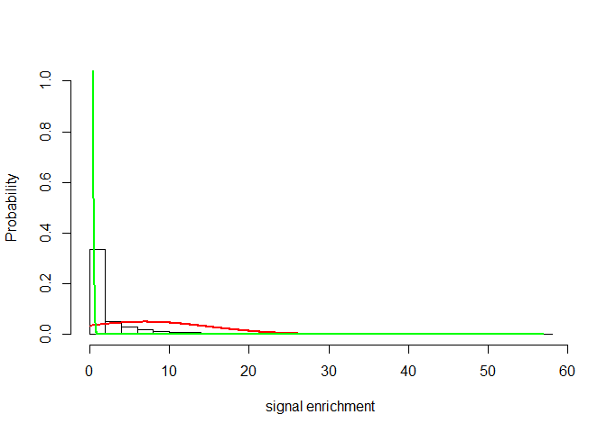
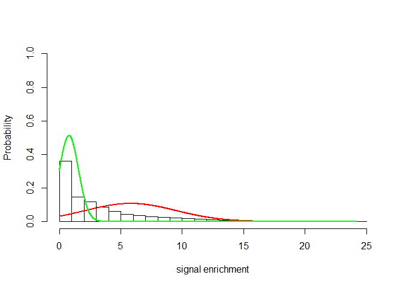
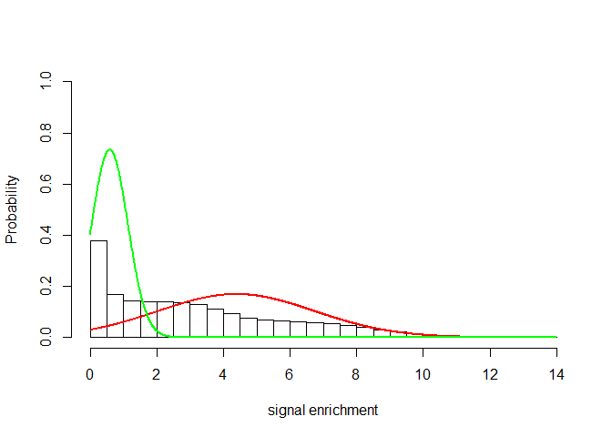
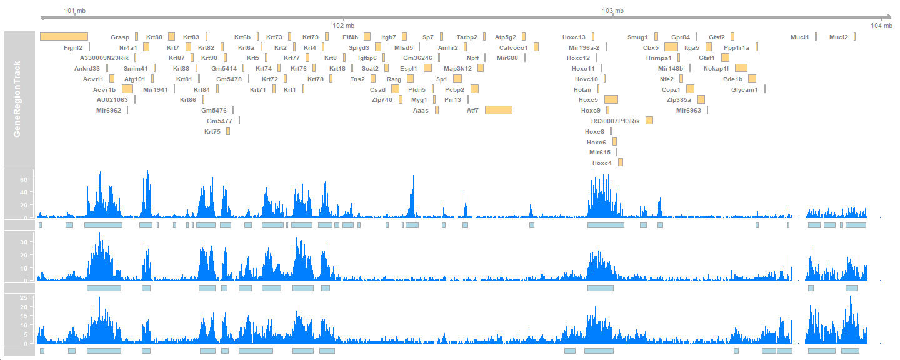

Load required libraries
-----------------------

``` r
require(mhsmm)
require(BSgenome.Mmusculus.UCSC.mm10)
require(rtracklayer)
require(dplyr)
require(glue)

# for plotting genome browswer view (optional)
require(Gviz)
require(TxDb.Mmusculus.UCSC.mm10.knownGene) 
require(org.Mm.eg.db)
# just for colorful plotting
require(crayon)
```

Load the scripts
----------------

``` r
source("utils.R")
```

Define the list of bw files
---------------------------

``` r
bw_file_paths = list(H2K27me3_MII = "bigWig_examples/H3K27me3_MII_mm10.sorted.Q10.dedup.sorted.bw",
                H2K27me3_2C = "bigWig_examples/H3K27me3_2C_mm10.sorted.Q10.dedup.sorted.bw",
                H2K27me3_4C = "bigWig_examples/H3K27me3_4C_mm10.sorted.Q10.dedup.sorted.bw"
                )
```

Load the mm10 blacklist regions (optional)
------------------------------------------

``` r
mm10_blacklist = "mm10-blacklist.v2.bed"
mm10_blacklist_gr = data.table::fread(mm10_blacklist)
colnames(mm10_blacklist_gr) = c("seqnames","start","end","Type")
mm10_blacklist_gr = GRanges(mm10_blacklist_gr)
mm10_blacklist_gr = subset(mm10_blacklist_gr, Type == "High Signal Region")

head(mm10_blacklist_gr)
```

    ## GRanges object with 6 ranges and 1 metadata column:
    ##       seqnames          ranges strand |               Type
    ##          <Rle>       <IRanges>  <Rle> |        <character>
    ##   [1]    chr10       0-3135400      * | High Signal Region
    ##   [2]    chr10 4613500-4615400      * | High Signal Region
    ##   [3]    chr10 4761300-4763900      * | High Signal Region
    ##   [4]    chr10 6281200-6286700      * | High Signal Region
    ##   [5]    chr10 6740200-6742100      * | High Signal Region
    ##   [6]    chr10 7396300-7429800      * | High Signal Region
    ##   -------
    ##   seqinfo: 21 sequences from an unspecified genome; no seqlengths

Call Domains
------------

``` r
H3K27me3_domains <- list()

for(bw in names(bw_file_paths)){
  bw_file= bw_file_paths[[bw]]
  H3K27me3_domains[[bw]] = CallDomains(bw_file = bw_file,
                                       winsize = 5000,
                                       stepsize = 5000,
                                       training.chrom = glue("chr{1:4}"),
                                       chromsToUse = glue("chr{1:19}"),
                                       genome = 'mm10',
                                       smooth = FALSE,
                                       mm10_blacklist_gr = mm10_blacklist_gr,
                                       saveProbs = FALSE,
                                       plot.model = TRUE,
                                       outDir = "HMMDomains"
                                       )
}
```

    ## 
    ## ******** Processing H3K27me3_MII_mm10.sorted.Q10.dedup.sorted.bw ********
    ## *) Training model
    ## Estimating the initial distribution P0

    ## Initialization parameters

    ## $P0
    ## [1] 0.09994937 0.90005063
    ## 
    ## $mu
    ## [1] 19.982045  1.578732
    ## 
    ## $sigma
    ## [1] 9.991023 1.578732
    ## 
    ## defining model



    ## Fitting model
    ## *) Detecting domains:
    ## Generating bed file
    ##  ====================
    ## Saved in :HMMDomains/H3K27me3_MII_mm10.sorted.Q10.dedup.sorted_5_domains.bed
    ## 
    ## 
    ## ******** Processing H3K27me3_2C_mm10.sorted.Q10.dedup.sorted.bw ********
    ## *) Training model
    ## Estimating the initial distribution P0

    ## Initialization parameters
    ## $P0
    ## [1] 0.2079394 0.7920606
    ## 
    ## $mu
    ## [1] 9.181240 1.643701
    ## 
    ## $sigma
    ## [1] 4.590620 1.643701
    ## 
    ## defining model



    ## Fitting model
    ## *) Detecting domains:
    ## Generating bed file
    ##  ====================
    ## Saved in :HMMDomains/H3K27me3_2C_mm10.sorted.Q10.dedup.sorted_5_domains.bed
    ## 
    ## 
    ## ******** Processing H3K27me3_4C_mm10.sorted.Q10.dedup.sorted.bw ********
    ## *) Training model
    ## Estimating the initial distribution P0

    ## Initialization parameters


    ## $P0
    ## [1] 0.3265698 0.6734302
    ## 
    ## $mu
    ## [1] 6.389107 1.593652
    ## 
    ## $sigma
    ## [1] 2.880374 1.499496
    ## 
    ## defining model



    ## Fitting model
    ## *) Detecting domains:
    ## Generating bed file
    ##  ====================
    ## Saved in :HMMDomains/H3K27me3_4C_mm10.sorted.Q10.dedup.sorted_5_domains.bed

Check the output folder
-----------------------

``` r
list.files("HMMDomains/",full.names = T)
```

    ## [1] "HMMDomains/H3K27me3_2C_mm10.sorted.Q10.dedup.sorted_5_domains.bed" 
    ## [2] "HMMDomains/H3K27me3_4C_mm10.sorted.Q10.dedup.sorted_5_domains.bed" 
    ## [3] "HMMDomains/H3K27me3_MII_mm10.sorted.Q10.dedup.sorted_5_domains.bed"

Visualize the detected domains
------------------------------

Let’s display the Hoxc locus as an example

``` r
hoxc.gr = GRanges("chr15:100859671-104043685")
```

``` r
txdb <- TxDb.Mmusculus.UCSC.mm10.knownGene

TxByGns <- genes(txdb)
TxByGns = subset(TxByGns, seqnames == seqlevels(hoxc.gr))

TxByGns$gene_name <- mapIds(org.Mm.eg.db,
                            keys = as.character(TxByGns$gene_id),
                            column = "SYMBOL",
                            keytype = "ENTREZID",
                            multiVals = "first")

TxDbTrack <- GeneRegionTrack(TxByGns,chromosome=seqlevels(hoxc.gr),gene = TxByGns$gene_name) 

gtrack <- GenomeAxisTrack()
bw_tracks <- c(gtrack, TxDbTrack)

seqlen = seqlengths(BSgenome.Mmusculus.UCSC.mm10)[seqlevels(hoxc.gr)]
region <- GRanges(seqlevels(hoxc.gr), IRanges(1,seqlen))

for(bw in names(bw_file_paths)){
  
  bw_file= bw_file_paths[[bw]]
  coverage <- import.bw(bw_file,which=region)
  dt <- DataTrack(coverage,chomosome=seqlevels(hoxc.gr),name = glue("{bw} signal")) 
  bw_tracks = c(bw_tracks, dt)
  
  atrack <- AnnotationTrack(H3K27me3_domains[[bw]], name = glue("{bw} domains"),chromosome = seqlevels(hoxc.gr))
  bw_tracks = c(bw_tracks, atrack)
}

plotTracks(bw_tracks, 
             chromosome=seqlevels(hoxc.gr),
             from = start(hoxc.gr),
             to = end(hoxc.gr),
             type="h",
           transcriptAnnotation="gene") 
```


